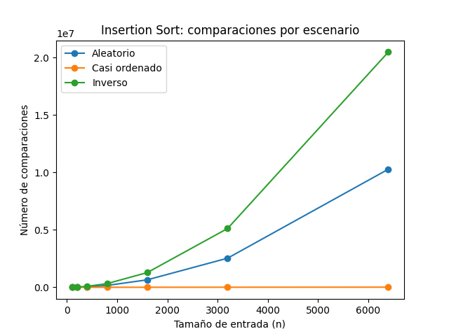
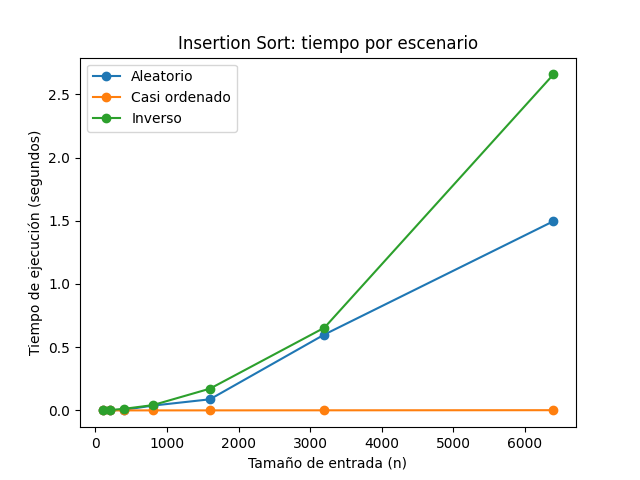
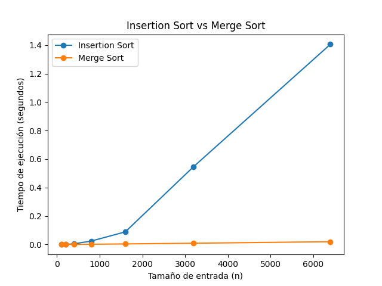

# Laboratorio 01 — Fundamentos, complejidad y recurrencias

## Realizado por

**Kevin Alejandro Grajales Camacho**

## Reproducción del experimento

El proyecto fue desarrollado en Python y utiliza un entorno virtual para gestionar las dependencias. Se emplea `matplotlib` para generar las gráficas de los experimentos.

### Archivos principales

- [`algoritmos.py`](algoritmos.py): implementa los algoritmos Insertion Sort y Merge Sort, incluyendo el conteo de comparaciones.
- [`datos.py`](datos.py): contiene las funciones para generar los datos utilizados en los experimentos.
- [`parte3_casos.py`](parte3_casos.py): ejecuta las pruebas de Insertion Sort con datos aleatorios, casi ordenados y en orden inverso.
- [`parte4_complejidad.py`](parte4_complejidad.py): compara los tiempos de ejecución de Insertion Sort y Merge Sort para diferentes tamaños de entrada.

### Preparación del entorno

Los siguientes comandos deben ejecutarse desde la raíz del repositorio.

Para activar el entorno virtual en PowerShell:

```powershell
.\venv\Scripts\Activate.ps1
```

### Ejecución de los experimentos

Para ejecutar el experimento de la Parte 3:

```powershell
python .\lab1-fundamentos-complejidad-recurrencias\parte3_casos.py
```

Para ejecutar el experimento de la Parte 4:

```powershell
python .\lab1-fundamentos-complejidad-recurrencias\parte4_complejidad.py
```

Los resultados de las mediciones se muestran en la terminal y las gráficas se guardan en la carpeta `graficas/` del laboratorio.

Las gráficas generadas pueden consultarse en las siguientes secciones:

- [Comparaciones de la Parte 3](graficas/parte3_comparaciones.png)
- [Tiempos de ejecución de la Parte 3](graficas/parte3_tiempo.png)
- [Tiempos de ejecución de la Parte 4](graficas/parte4_tiempo.png)

# Parte 1 — Analizar el algoritmo antes de comprar hardware

En el caso de Tamiza es importante diferenciar entre la corrección de un algoritmo y su eficiencia temporal. Un algoritmo es correcto si produce el resultado esperado. En este caso, el ordenamiento es correcto si Tamiza entrega los índices de riesgo de mayor a menor, como lo requiere el sistema. Sin embargo, que el resultado sea correcto no significa que se obtenga dentro del tiempo disponible.

Tamiza debe procesar hasta 1.200.000 registros dentro de una ventana de cuatro horas. Si se utiliza Insertion Sort, el número de comparaciones y desplazamientos puede crecer de forma cuadrática en el peor caso, es decir, proporcionalmente a (n^2). Esto significa que, cuando aumenta la cantidad de registros, el trabajo necesario puede crecer mucho más rápido que el tamaño de los datos.

Por ejemplo, si se duplica el número de registros, el trabajo del peor caso puede multiplicarse aproximadamente por cuatro. En cambio, duplicar la velocidad efectiva del servidor reduciría aproximadamente a la mitad el tiempo de ejecución, suponiendo que el proceso aproveche esa mejora de manera proporcional. Aunque esta mejora de hardware puede ayudar, no cambia la complejidad del algoritmo ni resuelve por sí sola el problema de escalabilidad. Por eso es importante evaluar primero el algoritmo antes de invertir en una máquina más potente.

Segundo ejemplo: procesamiento ETL

Un ejemplo diferente que conozco por las prácticas de la asignatura Inteligencia de Negocios es el procesamiento ETL de datos para cargarlos en SQL Server. Durante estas prácticas he trabajado con archivos que contienen numerosos registros que deben procesarse, transformarse y posteriormente cargarse en una base de datos.

Un proceso ETL puede realizar correctamente las transformaciones y cargar los datos sin errores, pero aun así resultar inviable si supera el tiempo disponible para completar la carga. Por ejemplo, si un proceso debe transformar y cargar aproximadamente 70.000 registros dentro de una ventana de ejecución establecida, es necesario evaluar tanto la exactitud de los datos como el tiempo que tarda en finalizar.

En este ejemplo no se dispone de una medición concreta del tiempo de procesamiento ni de una identificación de un algoritmo de ordenamiento específico, por lo que no sería correcto afirmar que el proceso incumple un límite real. Sin embargo, permite ilustrar que la corrección de los resultados y la eficiencia temporal son aspectos diferentes que deben evaluarse al diseñar un proceso de datos.

# Parte 2 — Responsabilidad ambiental y ética de la implementación

La elección de un algoritmo para Tamiza no solamente tiene consecuencias sobre el tiempo de procesamiento. También implica considerar los recursos computacionales utilizados, la confiabilidad de los resultados y las consecuencias que puede tener un error en el proceso.

Desde el punto de vista ambiental, un algoritmo que tarda más tiempo mantiene el procesador y otros componentes del sistema trabajando durante más tiempo. Si el proceso se ejecuta todas las madrugadas, ese consumo se repite diariamente. Por lo tanto, una diferencia en el tiempo de ejecución puede convertirse en un consumo acumulado considerable después de meses o años. Elegir un algoritmo eficiente puede contribuir a reducir el tiempo de procesamiento y el uso de recursos, aunque el impacto energético real también depende del hardware y de la infraestructura utilizada.

Desde el punto de vista ético, el resultado del ordenamiento tiene una consecuencia directa porque determina el orden en que se contacta a los pacientes. Si el algoritmo no termina antes de la hora establecida, el centro de contacto podría recibir una lista incompleta o que no refleje correctamente las prioridades definidas.

Un primer afectado sería el paciente. Si su registro queda fuera de la lista o aparece en una posición incorrecta, podría retrasarse su contacto para una valoración médica. En este caso, el costo del error recae principalmente sobre el paciente, aunque también existe una responsabilidad de la Secretaría de Salud y del equipo encargado del sistema.

Un segundo afectado sería el operador del centro de contacto. Si recibe una lista incompleta o mal ordenada, puede terminar contactando primero a pacientes que no corresponden a la prioridad establecida. El operador asume el costo operativo del problema, aunque su causa provenga del sistema.

Existe, además, un dilema ético importante: el ordenamiento determina quién será contactado primero y quién tendrá que esperar. Aunque el algoritmo organice correctamente los datos según el criterio programado, ese criterio debe ser adecuado y transparente. Por ejemplo, si se ordenan los registros por índice de riesgo de mayor a menor, es necesario verificar que el índice represente de manera apropiada la prioridad definida por la entidad responsable. Un algoritmo eficiente no garantiza por sí mismo que las decisiones de priorización sean justas.

También deben definirse reglas claras para los pacientes con el mismo índice de riesgo, validar los datos de entrada y comprobar que la lista final conserve el orden esperado. Así se reduce la posibilidad de que errores de información o decisiones de implementación afecten injustamente a una persona.

Por esta razón, la selección del algoritmo debe considerar tanto la corrección del resultado como su capacidad para cumplir la restricción de tiempo. Además, el proceso debe ser verificable y utilizar criterios de priorización definidos por los responsables de la atención. El ordenamiento no solamente organiza datos: influye en quién será contactado primero y, por ello, debe tratarse como una decisión con consecuencias humanas y operativas.

# Parte 3 — Peor caso, mejor caso y caso promedio

## 3.1 — Explicación y predicción

El peor caso corresponde al conjunto de entradas que produce el mayor
costo de ejecución para un tamaño de entrada fijo. No significa
simplemente que sea una entrada "mala", sino que representa la entrada
que exige más trabajo entre las posibles entradas de ese tamaño.

El mejor caso corresponde al conjunto de entradas que produce el menor
costo de ejecución para un tamaño fijo.

El caso promedio representa el comportamiento esperado considerando las
posibles entradas de un tamaño determinado y su distribución. En este
laboratorio se utiliza el escenario aleatorio como aproximación
experimental al comportamiento promedio.

Para Tamiza, la decisión debe considerar principalmente el peor caso,
porque la ventana de procesamiento de cuatro horas es estricta. Un
algoritmo que funciona rápidamente en una entrada favorable pero puede
tardar demasiado cuando cambia la forma de los datos representa un
riesgo para un proceso que tiene una hora límite.

Antes de realizar las mediciones, la predicción para los tres escenarios
fue la siguiente:

- **Escenario A — Aleatorio:** caso promedio.
- **Escenario B — Casi ordenado:** mejor caso o un comportamiento cercano
  al mejor caso.
- **Escenario C — Inverso:** peor caso.

Esta predicción se basa en que Tamiza necesita ordenar los índices de
riesgo de mayor a menor. En el escenario B, el 98 % de los registros ya
se encuentra en el orden requerido y solamente el 2 % restante se
agrega al final. En el escenario C, los datos llegan exactamente en el
orden contrario al requerido.

---

## 3.2 — Demostración experimental

Se implementó `insertion_sort` sin utilizar `sorted()` ni `list.sort()`.
El algoritmo trabaja sobre una copia de la lista recibida y cuenta las
comparaciones entre elementos.

Los tamaños utilizados fueron:

```text
100, 200, 400, 800, 1600, 3200, 6400
```

Las mediciones obtenidas para el número de comparaciones fueron:

| Tamaño | Aleatorio | Casi ordenado | Inverso |
|---:|---:|---:|---:|
| 100 | 2.597 | 99 | 4.950 |
| 200 | 10.318 | 201 | 19.900 |
| 400 | 40.436 | 409 | 79.800 |
| 800 | 160.484 | 852 | 319.600 |
| 1600 | 648.481 | 1.843 | 1.279.200 |
| 3200 | 2.533.103 | 4.242 | 5.118.400 |
| 6400 | 10.276.753 | 10.649 | 20.476.800 |

### Análisis de los resultados

El escenario B presenta el menor número de comparaciones. Esto se debe
a que la mayor parte de los datos ya está organizada de acuerdo con el
orden que necesita Tamiza.

El escenario C presenta el mayor número de comparaciones. Para `n=6400`
se obtuvieron exactamente 20.476.800 comparaciones.

Esto confirma experimentalmente el comportamiento cuadrático del peor
caso de insertion sort.

El escenario A se encuentra entre los otros dos y presenta un
comportamiento representativo del caso promedio.

La predicción realizada antes de medir coincide con los resultados
experimentales:

- **Mejor caso:** B — Casi ordenado.
- **Caso promedio:** A — Aleatorio.
- **Peor caso:** C — Inverso.

### Comparaciones por escenario



### Tiempo de ejecución por escenario



Las gráficas muestran que el comportamiento de los escenarios cambia
considerablemente a medida que aumenta el tamaño de entrada. El
escenario casi ordenado requiere mucho menos trabajo, mientras que el
escenario inverso presenta el mayor crecimiento.

---

# Parte 4 — Complejidad de Merge Sort e Insertion Sort

## 4.1 — Cálculo teórico

### Recurrencia de Merge Sort

Merge Sort divide la lista original en dos sublistas de aproximadamente (n/2) elementos. Después, ordena recursivamente cada sublista y finalmente utiliza la operación merge para combinar ambas listas ordenadas.

La recurrencia completa es:

\[
T(n)=2T(n/2)+\Theta(n)
\]

Donde:

(T(n)): tiempo necesario para ordenar una lista de tamaño (n).

(2T(n/2)): representa las dos llamadas recursivas, cada una encargada de ordenar aproximadamente la mitad de los elementos.

(\Theta(n)): representa el costo de combinar las dos sublistas mediante merge. En el peor caso, es necesario comparar elementos de ambas listas y recorrerlas para construir la lista resultante. Este trabajo crece linealmente con el número total de elementos.

### Método maestro

La forma general del método maestro es:

[
T(n)=aT(n/b)+f(n)
]

Para Merge Sort, los parámetros son:

[
a=2,\qquad b=2,\qquad f(n)=\Theta(n)
]

Calculamos la función que permite comparar el trabajo recursivo con el costo de combinar:

[
n^{\log_b a}=n^{\log_2 2}=n
]

Por lo tanto:

[
f(n)=\Theta(n)=\Theta(n^{\log_b a})
]

Se aplica el caso 2 del método maestro, porque el costo de combinar tiene el mismo orden de crecimiento que (n^{\log_b a}). En consecuencia, el tiempo de ejecución es:

[
T(n)=\Theta(n\log n)
]

Por lo tanto, la complejidad temporal de Merge Sort es (\Theta(n\log n)) en el mejor caso, el caso promedio y el peor caso.

## Complejidad de Insertion Sort

En la implementación utilizada, el ciclo externo recorre las posiciones desde \(i=1\) hasta \(i=n-1\), por lo que se ejecuta \(n-1\) veces.

**Mejor caso: lista ordenada de mayor a menor**

En cada iteración, el elemento actual se compara una vez con el elemento anterior. Como no es necesario desplazar elementos, el ciclo `while` termina inmediatamente.

- El ciclo externo se ejecuta \(n-1\) veces.
- La comparación entre elementos se realiza \(n-1\) veces.
- Los desplazamientos dentro del `while` se realizan 0 veces.

Por tanto, el costo crece linealmente:

\[
T(n)=an+b=\Theta(n)
\]

**Peor caso: lista ordenada de menor a mayor**

En cada iteración, el elemento actual debe desplazarse hasta el inicio de la parte ya ordenada. Para la posición \(i\), se realizan \(i\) comparaciones entre elementos y \(i\) desplazamientos.

| Instrucción u operación | Veces que se ejecuta |
|---|---:|
| Ciclo externo | \(n-1\) |
| Comparaciones entre elementos | \(1+2+\cdots +(n-1)\) |
| Desplazamientos de elementos | \(1+2+\cdots +(n-1)\) |

La suma de las comparaciones entre elementos es:

\[
C(n)=\sum_{i=1}^{n-1}i=\frac{n(n-1)}{2}
\]

Al desarrollar la expresión:

\[
C(n)=\frac{n^2-n}{2}
\]

El término dominante es \(n^2\). Los desplazamientos también tienen un costo cuadrático, mientras que las demás operaciones no cambian el orden de crecimiento. Por ello, la complejidad temporal del peor caso es:

\[
T(n)=\Theta(n^2)
\]

En el caso promedio, el número de comparaciones y desplazamientos también crece proporcionalmente a \(n^2\), por lo que su complejidad es \(\Theta(n^2)\).

### Tabla de complejidades

| Algoritmo | Mejor caso | Caso promedio | Peor caso |
|---|---|---|---|
| Insertion Sort | Θ(n) | Θ(n²) | Θ(n²) |
| Merge Sort | Θ(n log n) | Θ(n log n) | Θ(n log n) |

---

## 4.2 — Validación experimental

Se compararon Insertion Sort y Merge Sort utilizando el escenario
aleatorio y los mismos tamaños de entrada de la Parte 3.

Los resultados obtenidos fueron:

| Tamaño | Insertion Sort (s) | Merge Sort (s) |
|---:|---:|---:|
| 100 | 0.000297 | 0.000196 |
| 200 | 0.001197 | 0.000474 |
| 400 | 0.005197 | 0.001020 |
| 800 | 0.024343 | 0.002050 |
| 1600 | 0.089485 | 0.004374 |
| 3200 | 0.348817 | 0.010970 |
| 6400 | 1.382474 | 0.020990 |

En \(n=6400\), Insertion Sort tardó 1,382474 segundos, mientras que
Merge Sort tardó 0,020990 segundos en la última ejecución.

La relación entre ambos tiempos en esta medición fue aproximadamente:

\[
\frac{1,382474}{0,020990}\approx65,86
\]

Por lo tanto, para este tamaño de entrada y en esta ejecución,
Merge Sort fue aproximadamente 66 veces más rápido que Insertion Sort.

La diferencia aumenta a medida que crece el tamaño de entrada. Esto
coincide con el análisis teórico, porque Insertion Sort presenta un
crecimiento cuadrático en el caso promedio y Merge Sort presenta un
crecimiento de Θ(n log n).

### Comparación de tiempos



La gráfica muestra que la curva de Insertion Sort aumenta rápidamente
cuando crece `n`, mientras que la curva de Merge Sort crece de forma
mucho más lenta. Para tamaños pequeños la diferencia puede ser menos
visible, pero al aumentar el tamaño de entrada la diferencia se hace
mucho más clara.

---

# 4.3 — Concepto técnico para la Secretaría de Salud

Para Tamiza utilizaría Merge Sort como algoritmo principal de ordenamiento. La razón es que el volumen de entrada puede llegar a 1.200.000 registros y el proceso debe completarse dentro de una ventana de cuatro horas. Además, el equipo busca una solución cuyo rendimiento no dependa de que los datos lleguen previamente ordenados.

Insertion Sort puede comportarse bien cuando la entrada está casi ordenada, como ocurre en el escenario B. Sin embargo, su rendimiento empeora considerablemente cuando los datos llegan en orden inverso.

Esto se observa en las mediciones realizadas. Para 6.400 registros, el escenario casi ordenado necesitó 10.649 comparaciones, mientras que el escenario inverso necesitó 20.476.800.

En la comparación directa de algoritmos, para 6.400 registros aleatorios, la última ejecución registró 1,382474 segundos para Insertion Sort y 0,020990 segundos para Merge Sort. En esa ejecución, Merge Sort fue aproximadamente 66 veces más rápido. Estos tiempos pueden variar entre ejecuciones.

## Estimación para 1.200.000 registros

Las siguientes cifras son extrapolaciones basadas en las mediciones realizadas; no son resultados de una ejecución directa con 1.200.000 registros.

### Proyección de Insertion Sort en el peor caso

Se toma como referencia el escenario inverso de 6.400 registros, cuyo tiempo medido fue de 2,657296 segundos. Como el peor caso de Insertion Sort tiene complejidad cuadrática, se utiliza la siguiente relación:

\[
t_{\text{nuevo}}\approx 2,657296
\left(\frac{1.200.000}{6400}\right)^2
\]

El resultado es aproximadamente:

\[
t_{\text{nuevo}}\approx 93.411\text{ segundos}
\]

Esto equivale a unas **25,95 horas**, muy por encima de las cuatro horas disponibles. La estimación supone que el tiempo crece proporcionalmente a \(n^2\).

### Proyección de Merge Sort

Merge Sort tiene una complejidad temporal de \(\Theta(n\log n)\). Tomando como referencia la medición de 0,020990 segundos para 6.400 registros, se obtiene:

\[
t_{\text{nuevo}}\approx 0,020990
\left(
\frac{1.200.000\log_2(1.200.000)}
{6400\log_2(6400)}
\right)
\]

El resultado aproximado es de **6,3 segundos**. Esta cifra es una extrapolación teórica y no reemplaza una prueba con el volumen real. El uso de memoria, la implementación y las características del equipo pueden modificar el resultado.

## ¿Duplicar la velocidad del servidor resolvería el problema?

Duplicar la velocidad efectiva del servidor podría reducir aproximadamente a la mitad los tiempos de ejecución, suponiendo que el proceso aproveche esa mejora de manera proporcional. Sin embargo, no cambia la complejidad temporal del algoritmo.

Si la proyección del peor caso de Insertion Sort es de 25,95 horas, reducir ese tiempo a la mitad daría aproximadamente 12,97 horas. El proceso seguiría superando la ventana disponible de cuatro horas. Por tanto, mejorar el hardware no soluciona por sí solo el problema de escalabilidad.

## Consideraciones éticas y operativas

El ordenamiento no es solamente una operación técnica: si los registros representan pacientes que esperan atención, el orden resultante puede determinar quién recibe primero una llamada. Por ello, los criterios de priorización deben ser explícitos, verificables y coherentes con las reglas definidas por la entidad responsable.

El algoritmo debe ordenar según criterios de prioridad previamente establecidos, no decidir por sí mismo qué paciente merece atención primero. También es necesario validar los resultados, evitar que errores de datos alteren la prioridad y definir cómo se resolverán los empates. La rapidez del proceso debe acompañarse de transparencia y de una revisión adecuada de los criterios utilizados.

Merge Sort requiere memoria adicional para combinar las listas, por lo que ese consumo debe tenerse en cuenta en la infraestructura disponible. Aun así, para un proceso que puede alcanzar 1.200.000 registros y dispone de una ventana estricta, su crecimiento temporal resulta más adecuado que el de Insertion Sort.

Por estas razones, recomendaría Merge Sort como algoritmo general de ordenamiento para Tamiza, acompañado de pruebas con el volumen real, validación de los criterios de priorización y seguimiento del tiempo de ejecución.

# Conclusiones

El experimento permitió observar que el comportamiento de un algoritmo de ordenamiento depende tanto del tamaño de la entrada como de la organización inicial de los datos.

Insertion Sort presentó un comportamiento favorable cuando los datos estaban casi ordenados, pero su costo aumentó considerablemente en el escenario inverso. Para (n=6400), este último escenario alcanzó 20.476.800 comparaciones, mientras que el escenario casi ordenado necesitó solamente 10.649. Esto demuestra que el orden inicial de los datos puede influir significativamente en el rendimiento del algoritmo.

La comparación experimental de la Parte 4 también mostró una diferencia importante entre los algoritmos. Para
\(n=6400\), en la última ejecución realizada con datos aleatorios, Insertion Sort tardó 1,382474 segundos y Merge Sort tardó 0,020990 segundos. Estos tiempos pueden variar entre ejecuciones, pero los resultados observados son coherentes con la diferencia entre sus complejidades temporales.

El análisis teórico permitió establecer que Insertion Sort tiene una complejidad de \(\Theta(n)\) en el mejor caso y de \(\Theta(n^2)\) en el caso promedio y el peor caso. Por su parte, Merge Sort mantiene una complejidad temporal de \(\Theta(n\log n)\) en los tres casos. Esta diferencia resulta especialmente importante cuando aumenta considerablemente el volumen de datos.

Para Tamiza, que puede procesar hasta 1.200.000 registros dentro de una ventana de cuatro horas, las estimaciones muestran que el peor caso de Insertion Sort podría superar ampliamente el tiempo disponible, incluso si se duplica la velocidad efectiva del servidor. Merge Sort presenta un crecimiento temporal más favorable, aunque sus estimaciones deben comprobarse mediante pruebas con el volumen real y teniendo en cuenta el consumo de memoria.

Finalmente, el laboratorio demuestra que la selección de un algoritmo no debe basarse únicamente en que produzca resultados correctos. También es necesario evaluar su complejidad, medir su rendimiento en distintos escenarios y considerar los recursos disponibles. En un sistema que organiza pacientes según criterios de riesgo, estas decisiones deben acompañarse de validaciones que garanticen que la lista final respete las prioridades definidas y no genere errores que puedan afectar la atención.